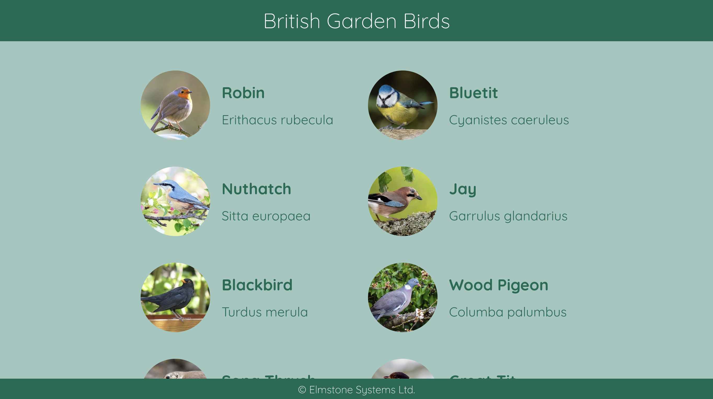

#### Bird API

The /birds route needs changing to return the bird data from public/data.json in alphabetical order.

Complete the route, and create a unit test using any test framework.

Create a website with Create-React-App in typescript to display the birds as shown below. The site should be coded with function components and css / scss modules. The header and footer should both be sticky.

---------------------------------------------------------------------------------------
Instructions to run application:

See src\routes\birds/index.ts for updated route that fetches birds data. 

See tests\unit_test.test.ts for Jest Unit tests

See front-end-app folder for React app created using 'Create-React-App'

Run the node application 'npm run build && npm start'

Run the front-end-app by cd front-end-app\birds-app and run 'npm start' which should run on port 3000

